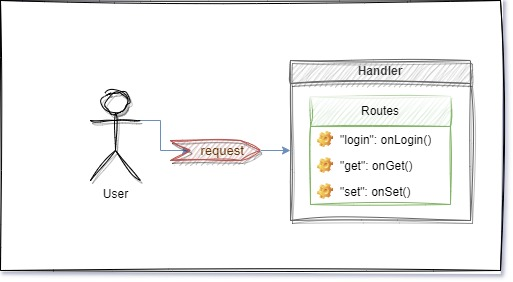

# Contributing to handler-lib

Thank you for contributing. This document covers architecture and internals. For usage and tutorials, see [README.md](README.md).

## Overview

Handler-lib routes ZeroMQ messages to user-defined Go functions. Each handler owns its ZeroMQ socket and starts a control manager for lifecycle commands. ZeroMQ sockets are not thread-safe, so socket reads and writes stay in the goroutine that owns the socket.



*Diagram: [Source](https://drive.google.com/file/d/1B0JOWbrbby9yUy66pMwWnlf8ic18XOs-/view?usp=sharing)*

The `base` package defines `Handler` and `base.Interface`. Do not use `base.Handler` directly in application code; use a derived handler (`sync_replier`, `replier`, `publisher`, `worker`).

## Glossary

| Term | Meaning |
|------|---------|
| **Send** | Handler–user interaction (generic) |
| **Request** | Sender expects a reply |
| **Submit** | Message sent without expecting a reply (fast, no delivery guarantee) |

## Route

A route has three parts:

1. **Command** — name the client sends in the request
2. **Handle function** — `base.HandleFunc`

## Config package

Handler configuration lives in `config`:

| File / type | Role |
|-------------|------|
| `Handler` | Type, Category, embedded message Endpoint |
| `config.go` | `NewHandler`, handler types |
| `control.CreateInternalConfig` | Internal `inproc://` URL for the control manager |

### Handler URLs (external)

`message.Endpoint.HandlerUrl` is for external sockets. Control endpoints are created by `control.CreateInternalConfig`.

| Port | Id | Bind URL |
|------|-----|----------|
| non-zero | `localhost` or `127.0.0.*` | `tcp://*:{Port}` |
| non-zero | anything else | `tcp://{Id}:{Port}` |
| 0 | starts with `tmp` | `ipc:///{Id}` |
| 0 | otherwise | `inproc://{Id}` |

Clients use the same `Id` and `Port` with `message.Endpoint.ClientUrl` or [`client-lib/config.Url`](https://github.com/noPerfection/protocol/client).

## Internal parts

### Handler socket loop

Each handler binds its external socket and owns the receive loop for that socket:

- `sync_replier` uses REP and handles one request at a time.
- `replier` uses ROUTER and runs route handlers asynchronously, sending replies back through the owning socket loop.
- `worker` uses PULL and runs route handlers asynchronously without sending replies.
- `publisher` uses PUB plus a manager route for broadcast commands.
- `pair` uses PAIR for protocol adapters and in-process forwarding.

### Handler manager

The control manager exposes common routes such as `status`, `config`, `start`, and `close`. External management goes through `control` routes or [`manager_client`](manager_client/manager_client.go).

Socket closing should be requested through the handler or control route that owns the socket; do not close a ZeroMQ socket from another goroutine.

## Overwriting behavior

Handlers can override aspects of parts (custom handlers or SDS services). This does not replace entire packages—only selected hooks.

### Handler manager

You may override management routes (not add new route names).

### Pair layer

Add a protocol adapter by pairing another handler with the original handler config.

Flow:

1. Run your protocol server (e.g. HTTP) on the handler port
2. Configure a `pair.Pair` handler with `config.PairType`
3. Connect a PAIR client to the pair handler endpoint to forward requests into the handler

See [`pair/pair.go`](pair/pair.go). HTTP example: [web-lib](https://github.com/sds-framework/web-lib).

### Message operations

Handlers that support `SetMessageOperations` can override request and reply parsing. Custom messages must implement `message.RequestInterface` and `message.ReplyInterface`. Defaults: `message.Request`, `message.Reply`.

## Development

```bash
go test ./...
```

Requires ZeroMQ 4.x (`libzmq3-dev` on Debian/Ubuntu).

## Related repositories

- [client-lib](https://github.com/noPerfection/protocol/client) — connect to handlers
- [datatype-lib](https://github.com/noPerfection/datatype) — request/reply types
- [service-lib](https://github.com/sds-framework/service-lib) — service orchestration
- [web-lib](https://github.com/sds-framework/web-lib) — HTTP over handler pair
